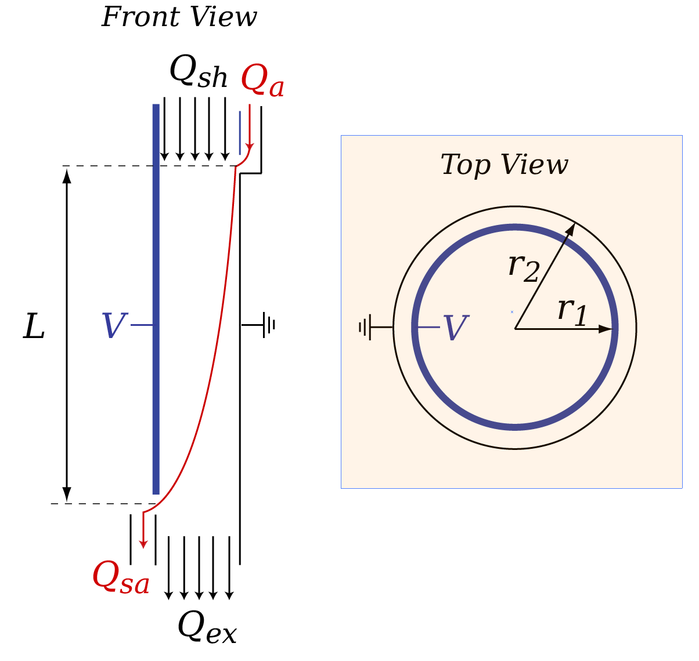

# DifferentialMobilityAnalyzers.jl

*A Julia package for working with data from differential mobility analyzers.*

DifferentialMobilityAnalyzers.jl bundles a set of abstractions to write concise forward and inverse models of experimental setups that involve  differential mobility analyzers. Abstractions include specialized data types, operators, functions, and conventions. Conventions include rules for typesetting fonts and sub- and superscripting variables. 

**Figure.** Schematic of a differential mobility analyzer. The cylindrical differential mobility analyzer is an annular capacitor. The column's properties are defined by the radii ``r_1``, ``r_2``, the length of the aerosol path, ``l``. Operation conditions are defined by the the electric potential $v$ applied across the annulus and the four flow rates: sheath flow, ``q_{sh}``, polydisperse aerosol flow ``q_a``, excess flow, ``q_{ex}``, and monodisperse sample flow, ``q_{sa}``. Throughout this work it is assumed that the flows are balanced, i.e. ``q_{sh} = q_{ex}`` and ``q_{sa} = q_a``. The two flows tracked are ``q_{sh}`` and $q_{sa}``. 

## Package Features

- Primitives to simplify working with size distribution data
- Implementation of physical equations describing DMAs
- Computational solution of the discretized Fredholm integral equation
- Generation of custom convolution matrices 
- Fast size distribution inversion using Tikhonov regularization
- Modeling of particle transmission through single and chained DMA setups